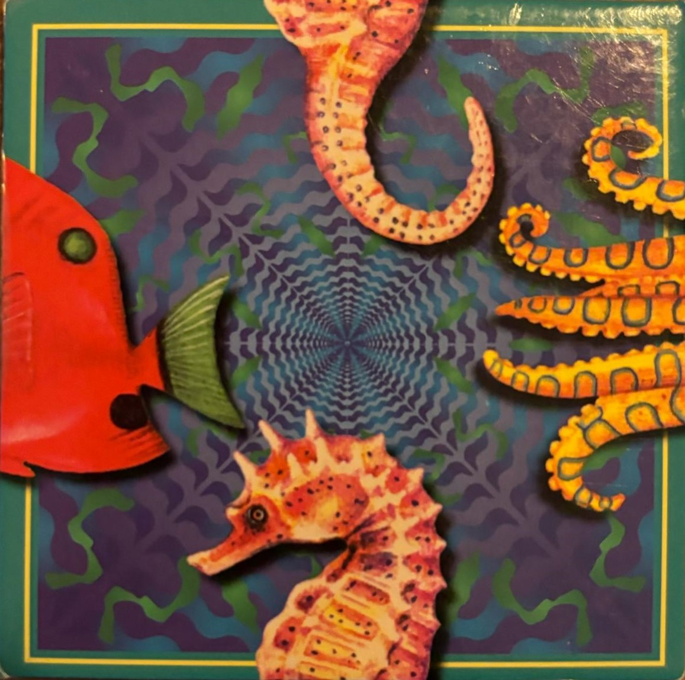
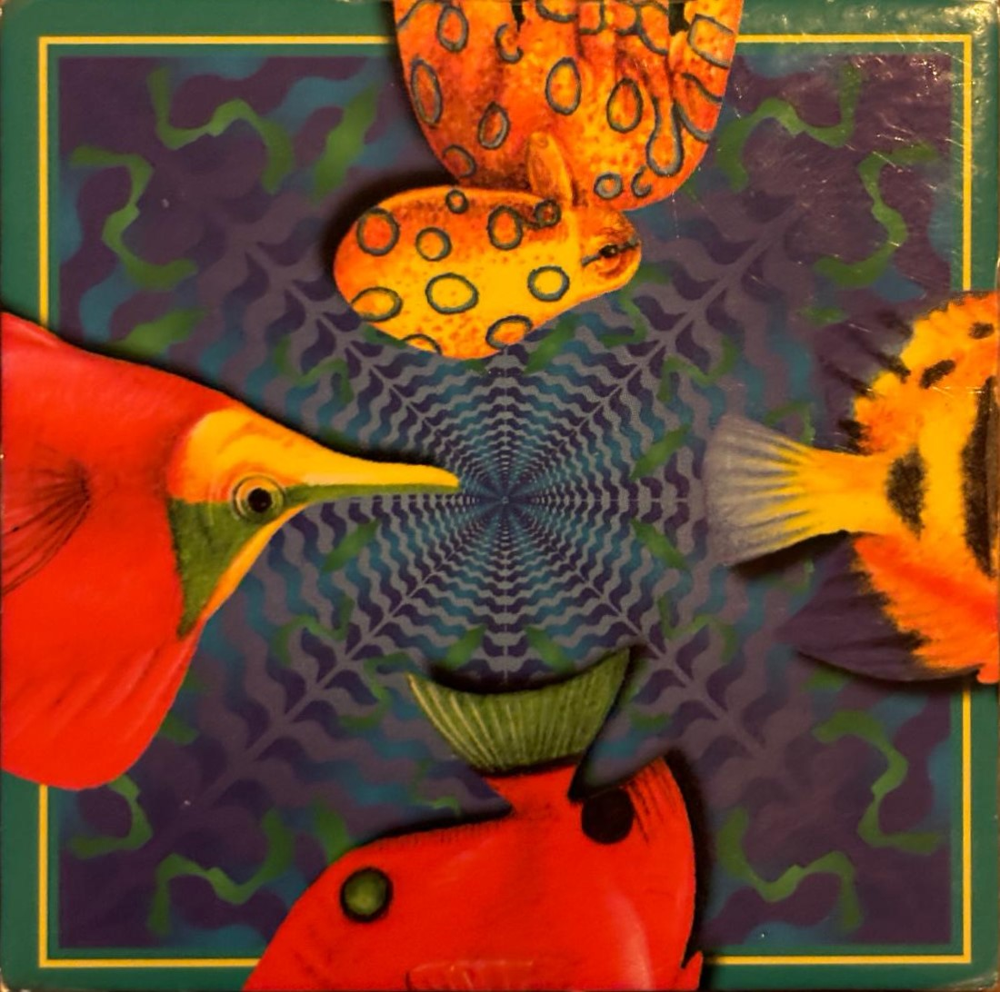
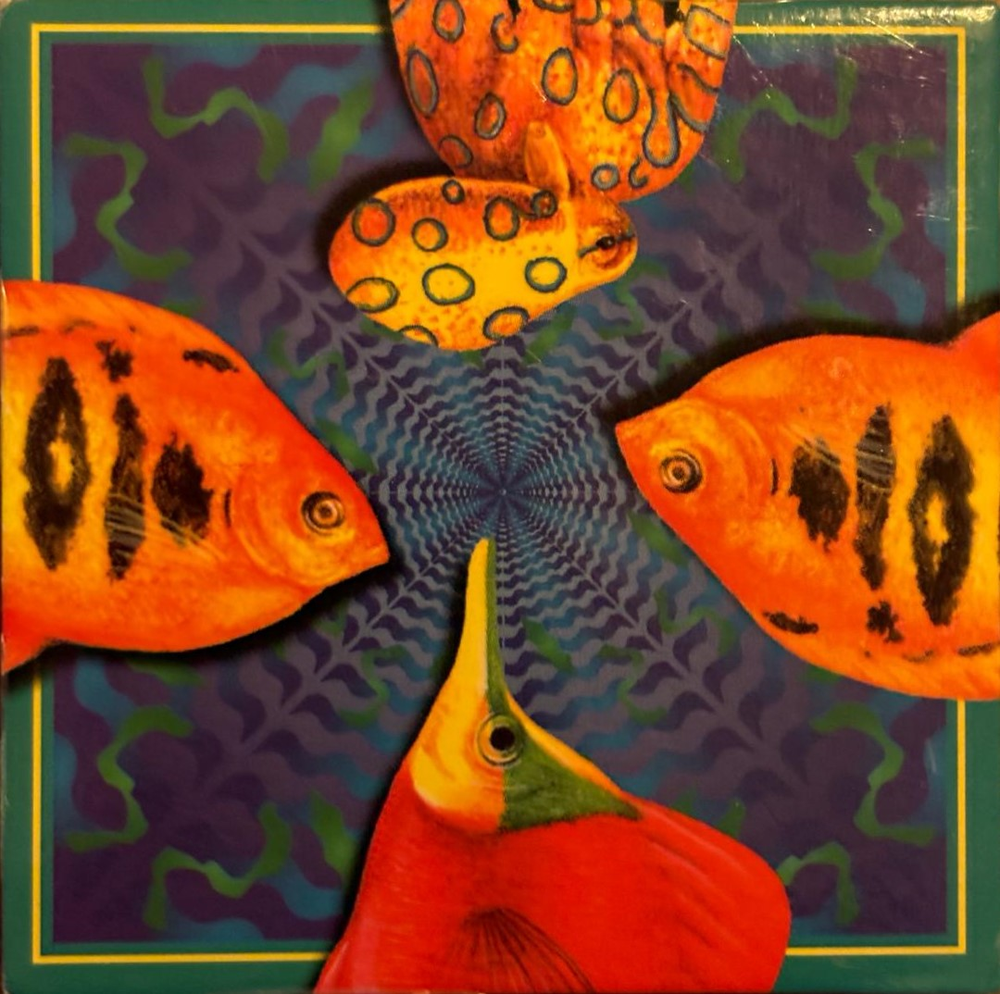
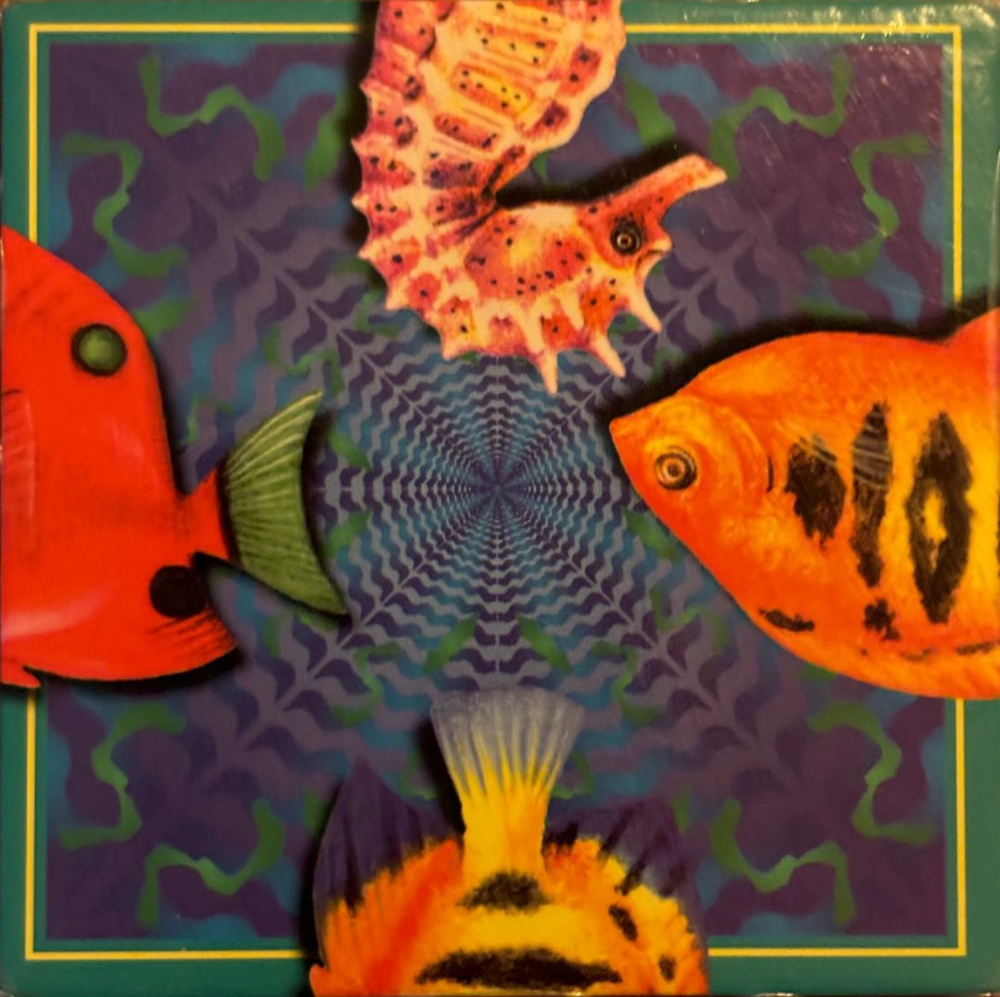
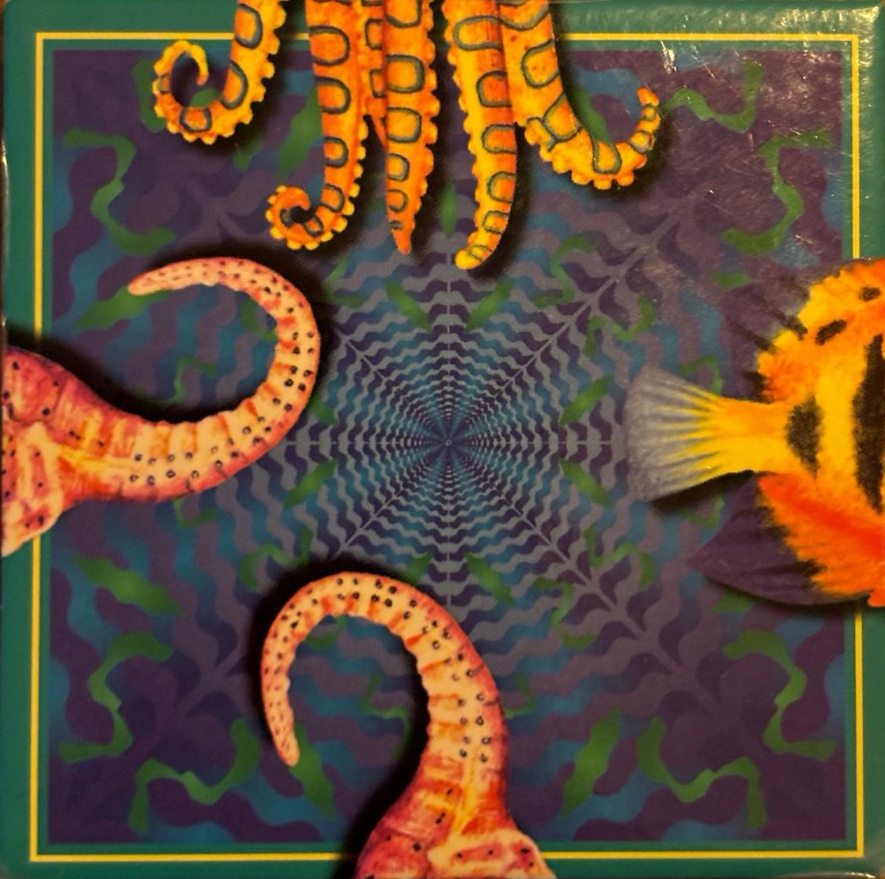
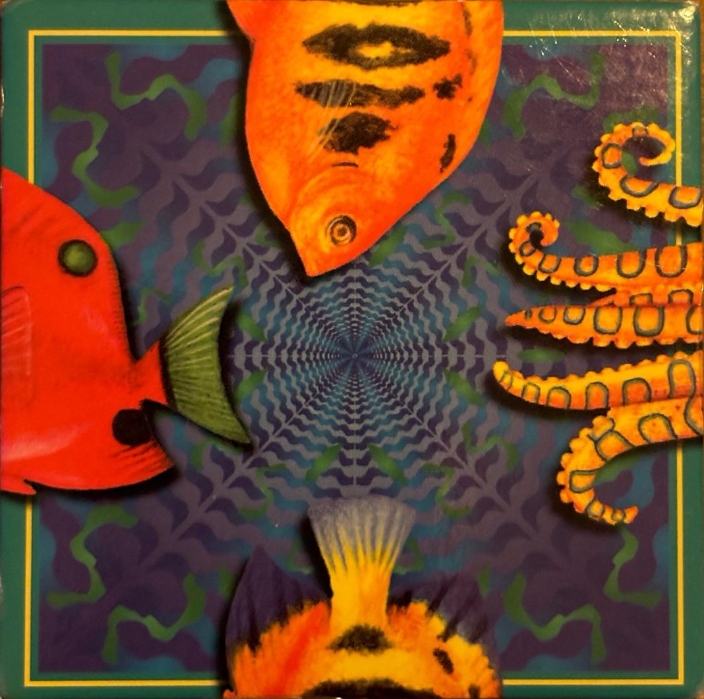
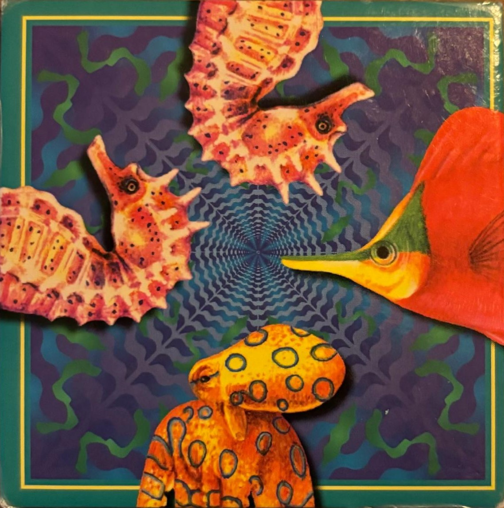
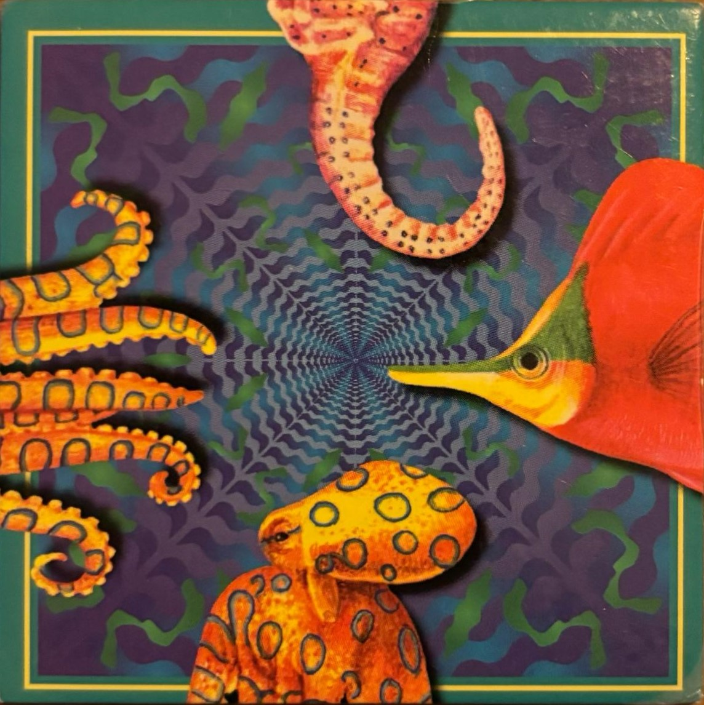
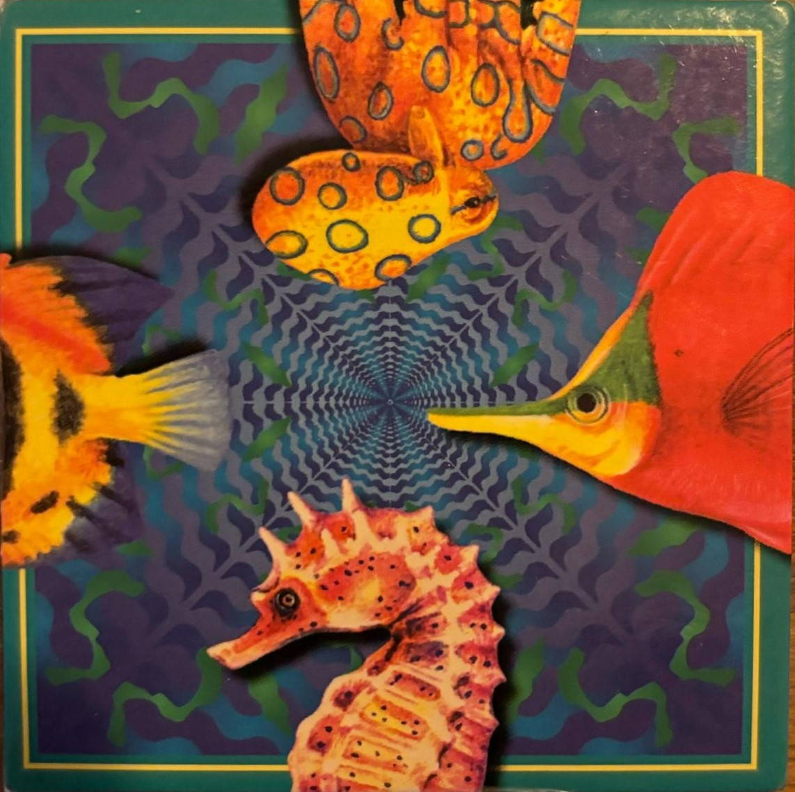

# HiIT-JS_Puzzle
 ...

## 9Piece Edge Puzzle
Een puzzle met 9 stukken, elk stuk heeft 4 halve tekeningen/symbolen, waarvan de andere helft op een ander puzzlestuk staat.  
Het doel is om een 3x3 vlak te leggen, waar alle tekeningen/symbolen volledig zijn. i.e De bovenhelft aan de onderheft van het symbool.  

## Het doel van deze opdracht is als volgt:
### versie 1.
  - Maak een klik-sleep speelveld om Puzzlestukken in het 3x3 Grid te slepen: Klik/sleep, rotatie
  - Maak een GameManager die controleert of het Puzzle stuk op een geldige plek ligt en bij extend of de puzzle opgelost is.

### versie 2.
  - Maak een hints systeem, waar een mogelijke volgende stap wordt laten zien.

### versie 3.
  - autocomplete door gamemanager. Los de puzzle op door de pc

## Functionality Scetch
We start with an empty 3x3 Grid and 9 Puzzle Pieces. Each Piece has 4 halfs of a symbols, the other half is on the other pieces.  
To Finish the Puzzle, we want to connect all Pieces with a Head and Body half, without a mismatch of symbolhalves.   
In short: all connecting pieces should create a complete symbol.  

 Step 1. Choose Piece on Position  
 Step 2. Find empty neighbor and connect a possible Piece  
 Step 3. Find all empty neighbors and connect the possible Pieces  
 Step 4. Find a Piece that fits the Current Empty Tile  
 Step 5. If no Piece Found: Restart. 
        If Piece Found: Solved.   

## Board & Pieces
Board  
  Row:[#0-2] Cell:[#0-2] Occupied:[True/False]  
  
Pieces  
  uID {[Pieces][Sides][Types][Variant]}  
  uPos {[Row][Cell][Rotation]}  
  
Placement  
  Possible Positions Array [Row][Cell][Occupied=False]  
  Priority 0 - 8 = Priority given to a Piece for a specific place on the board  
  Locked True/False = Locked Pieces in position for current solution  

### Pieces Array Adress Legend
Piece:[#0-8] Side:[#0-3] Type:[#0-3] Variant:[#0-1]  
Pieces:    
 0 
 1 
 2   
 3 
 4 
 5   
 6 
 7 
 8   
Sides: (arguments 1-4: Same behaviour as CSS Borders?)  
 0 Top  
 1 Right  
 2 Bottom  
 3 Left  
Types:  
 0 Goldfish  
 1 Seahorse  
 2 Octopus  
 3 RedFish  
Variants:  
 0 Head  
 1 Body  
  
#### Array adress:  
 0   
uid: #0011 - piece[0].side[0].type[1].variant[1]  
uid: #0121 - piece[0].side[1].type[2].variant[1]  
uid: #0210 - piece[0].side[2].type[1].variant[0]  
uid: #0331 - piece[0].side[3].type[3].variant[1]  
 1   
uid: #1020 - piece[1].side[0].type[2].variant[0]  
uid: #1101 - piece[1].side[1].type[0].variant[1]  
uid: #1231 - piece[1].side[2].type[3].variant[1]  
uid: #1330 - piece[1].side[3].type[3].variant[0]  
 2   
uid: #2020 - piece[2].side[0].type[2].variant[0]  
uid: #2100 - piece[2].side[1,3].type[0].variant[0]  
uid: #2230 - piece[2].side[2].type[3].variant[0]  
uid: #2300 - piece[2].side[1,3].type[0].variant[0]  
 3   
uid: #3010 - piece[3].side[0].type[1].variant[0]  
uid: #3100 - piece[3].side[1].type[0].variant[0]  
uid: #3201 - piece[3].side[2].type[0].variant[1]  
uid: #3331 - piece[3].side[3].type[3].variant[1]  
 4   
uid: #4021 - piece[4].side[0].type[2].variant[1]  
uid: #4101 - piece[4].side[1].type[0].variant[1]  
uid: #4211 - piece[4].side[2,3].type[1].variant[1]  
uid: #4311 - piece[4].side[2,3].type[1].variant[1]  
 5   
uid: #5000 - piece[5].side[0].type[0].variant[0]  
uid: #5121 - piece[5].side[1].type[2].variant[1]  
uid: #5201 - piece[5].side[2].type[0].variant[1]  
uid: #5331 - piece[5].side[3].type[3].variant[1]  
 6   
uid: #6010 - piece[6].side[0,3].type[1].variant[0]  
uid: #6130 - piece[6].side[1].type[3].variant[0]  
uid: #6220 - piece[6].side[2].type[2].variant[0]  
uid: #6310 - piece[6].side[0,3].type[1].variant[0]  
 7   
uid: #7011 - piece[7].side[0].type[1].variant[1]  
uid: #7130 - piece[7].side[1].type[3].variant[0]  
uid: #7220 - piece[7].side[2].type[2].variant[0]  
uid: #7321 - piece[7].side[3].type[2].variant[1]  
 8   
uid: #8020 - piece[8].side[0].type[2].variant[0]  
uid: #8130 - piece[8].side[1].type[3].variant[0]  
uid: #8210 - piece[8].side[2].type[1].variant[0]  
uid: #8301 - piece[8].side[3].type[0].variant[1]  
  
### Pieces Location Adress Legend  
 Row:[#0-2] Cell:[#0-2] Rotation:[#0-3]  
Position:  
Cell |   |-|  0 |  1 |  2 |  
     |---|-|----|----|----|  
 Row | 0 |-| 00 | 01 | 02 |  
 Row | 1 |-| 10 | 11 | 12 |  
 Row | 2 |-| 20 | 21 | 22 |  
  
Rotation:   
  0 = 0°  
  1 = 90°  
  2 = 180°  
  3 = 270°  
  
#### Location Adress  
  uid: #000 - X:0 Y:0 Rot:0  
  uid: #010 - X:0 Y:1 Rot:0  
  uid: #020 - X:0 Y:2 Rot:0  
  uid: #100 - X:1 Y:0 Rot:0  
  uid: #110 - X:1 Y:1 Rot:0  
  uid: #120 - X:1 Y:2 Rot:0  
  uid: #200 - X:2 Y:0 Rot:0  
  uid: #210 - X:2 Y:1 Rot:0  
  uid: #220 - X:2 Y:2 Rot:0  
  

## Checks & Priority  
We look through all the Unoccupied Tiles []  
We look through all the Unused Pieces []  
We Select a starting Piece00, with a rotation on a Starting position.  
We Remove the Tile from the Unused Tiles []  
We Remove the Piece00 form the Unused Pieces []  
 //We Add the PieceData [] to the TableState []  
  
Step First Neighbor  
Next we decide which Tile to select.  
 We look at all Unoccupied Tiles []  
 We select a Tile, with X+1/-1 or Y+1/-1  
 We Save each Tile as a Possible Position []  
  
Next we decide which piece to play next.  
 We look at all Unused Pieces []  
 We search for the negative Variant of the previous Piece00 Symbols []  
  also using Rotations  
 We Save each Piece01 as a Possible Choice []  
  
Step Second Neighbors  
 We check if the hypothetical neighbours can connect in the current state  
  
We go through all Possible Choices[] on Possible Position[]  
 we Look at each Neighbor tile  
 We choose a fitting piece  
 Next we check all Neighbors  

 For each Possible Choice we check 
 If the can ++ Priority for the Possible Choice [Piece]
 If the can't -- Priority for the Possible Choice [Piece]

Step Third Neigbors

Step Priority Check 
 We Select a Possible Choice with the Highest Priority Ranking
 We Place the Second Piece

[Input Rquest Array] Starting Piece with Rotation, on Row and Cell Position
[Previous Request Array] Save to help users try new input
[Unoccupied Positions Array] Array of empty Positions
[Current Board Status] State of the Board, filled with the placed Pieces.
PriorityRank Ranking of the Piece, Higher Priority Rank is greater chance of selection.

Input Request: [0-8][0-3][0-2][0-2]
Select a Starting Piece
 With Starting Rotation
 On Starting Row
 And Starting Cell
Save to [Previous Request Array]

Checks:
Check the Neighborhood for Unoccupied Tiles. Save these Tiles to the Unoccupied Positions Array.
// TABLE CHECK ()
For (Row < 2)
 For (Cell < 2)
 // OCCUPATION CHECK ()
  If ([Row+X][Cell+Y][Occupied = False])
   Add to [Unoccupied Positions Array]

Select a New Piece
 Option 1. Based on User Input
 Option 2. Based on Array Position (Next Piece)
 Option 3. Based on First Symbol (Top Symbol Variant)
 Option 4. Based on Priority Rating

Rotate a Piece to connect to another piece with the same symbol
// ROTATION CHECK ()
For (Rotation < 3)
If ([Row][Cell] [Piece][Side][Type] == [Row][Cell][Rotation] [Piece][Side][Type])  
  
Check if the Type is the Same, next check if the variant is the negative of   the other.  
// TYPE CHECK ()  
If ([Piece][Side][Type] == [Piece][Side][Type])  
// VARIANT CHECK ()  
 If ([Variant] *-1 [Variant])  
  = Complete Symbol: Increase Priority  
  
// TABLE CHECK ()  
For (Row < 2)  
 For (Cell < 2)  
  
// GetCellState (xRow, yCell)  
Return (isOccupied, [PieceData])  
// SetCellState (xRow, yCell, isOccupied, [PieceData])  
_isOccupied = isOccupied  
_[PieceData] = [PieceData]  
  
//   
  
Priority:   
 +Pri = if a piece connects to another piece (Range: 1-4)  
 -Pri = if no connects (Range: 1-4)  
   
 +Pri = if connected pieces connect to another piece (Range: 1 - 8)  
 -Pri = if no connects (Range: 1-4)  
  
With Priority of 8 = Found 1 Solved State  
